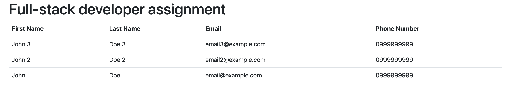

# Full-stack developer technical assignment

This is an assignment for the full-stack developer technical interview.

The Golang project here have some issues that need tobe fixed before the unit test could run successfully, and the service could run normally.

### Overview

1. Our objective is to build a simple survey form (form.html) and save the data into `/data/forms.json` file.
2. View the saved result from `/data/forms.json`

### Tasks

The task for the assignment is listed below

- Investigate the issues that prevent the binary from not working
- Investigate the issues that prevent the unit test to not running successfully
- Fix all the issue that you have found
- Explain all the issues you have found, and the approaches you take to fix those issues

### Expected outcome

- Navigate to `form.html` file and click the submit button, the browser should navigate to the next page with display text `form saved`

- View the result in table row like the example screenshot below

